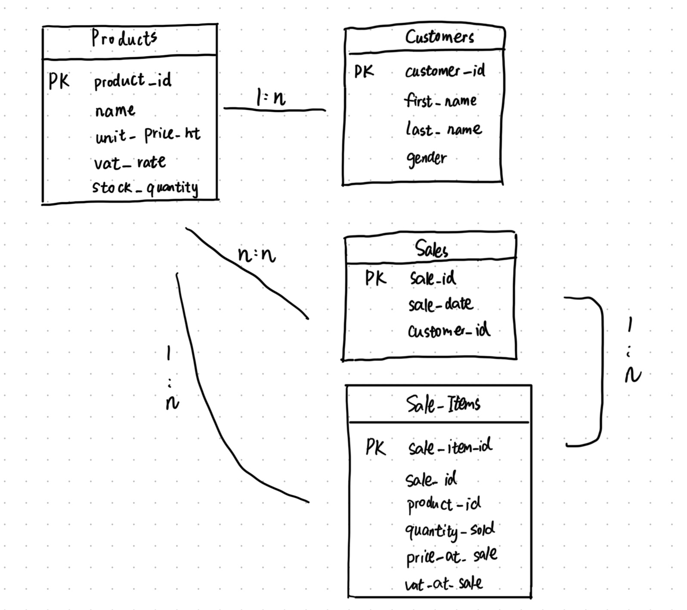

### **Project Report: Farm Store Management System**

**Course:** USCH1B - Software Engineering 1: Database Principles and Applications - SQL
**Student Name:** Zijie XU, Zhinan XIONG,Mian WU
**Date:** 2025.12.31

---

### **Table of Contents**

1.  **Project Introduction**
    *   1.1. Objectives
    *   1.2. Core Features
2.  **Database Design**
    *   2.1. Entity-Relationship Diagram (ERD)
    *   2.2. Relational Schema
3.  **System Architecture and Design Choices**
    *   3.1. Three-Tier Architecture
    *   3.2. Technology Stack
    *   3.3. Key Design Decisions
4.  **Conclusion**
5.  **Appendix: Code Listings**
    *   A.1. Frontend HTML (`index.html`)
    *   A.2. Frontend CSS (`style.css`)
    *   A.3. Frontend JavaScript (`script.js`)

---

### **1. Project Introduction**

#### **1.1. Objectives**

The primary objective of this project was to develop a web-based database application for the manager of a farm products store. The application is designed to simplify daily operations by providing a centralized system for managing products, tracking loyal customers, monitoring inventory, and generating sales reports. The end product is a user-friendly, single-page dashboard built with Node.js, MySQL, and vanilla JavaScript.

#### **1.2. Core Features**

The application successfully implements all the requirements outlined in the first part of the project brief, as well as several bonus features:

*   **Product Management:** Add new products and view a real-time list of all available items.
*   **Inventory Control:** Manually increase or decrease the stock for any product to reflect farm deliveries or corrections. The dashboard provides visual cues for low-stock items.
*   **Customer Management:** Maintain a list of loyal customers with full CRUD operations (Create, Read, Update). Customers can be edited via a modal dialog.
*   **Sales Recording:** A streamlined interface to record sales, handle items for both registered and walk-in customers, and automatically update inventory levels.
*   **Sales History:** View recent sales transactions with product details, quantities, prices, and customer information.
*   **Sales Reporting (Bonus Feature):** A tool to view total sales revenue over a user-selected date range with internationalized date pickers.
*   **Multi-language Support (Bonus Feature):** Full internationalization (i18n) with support for English, Chinese, and French. All UI elements, including date pickers, dynamically switch languages.
*   **One-Click Setup:** Cross-platform setup scripts (Windows `.bat` and Unix `.sh`) for automatic environment configuration and server launch.

### **2. Database Design**

A robust database is the foundation of this application. The design process began with an Entity-Relationship Diagram (ERD) to model the data, which was then translated into a normalized relational schema.

#### **2.1. Entity-Relationship Diagram (ERD)**

The data model consists of four main entities: `Products`, `Customers`, `Sales`, and a linking entity `Sale_Items`. The many-to-many relationship between `Sales` and `Products` (a sale can have many products, and a product can be in many sales) is resolved using the `Sale_Items` associative table. This ensures the database is in Third Normal Form (3NF), preventing data redundancy and anomalies.




#### **2.2. Relational Schema**

The ERD was translated into the following relational schema. Primary Keys (PK) are underlined, and Foreign Keys (FK) are noted.

**Products** (
<u>`product_id`</u> INT PK,
`name` VARCHAR,
`unit_price_ht` DECIMAL,
`vat_rate` DECIMAL,
`stock_quantity` INT
)

**Customers** (
<u>`customer_id`</u> INT PK,
`first_name` VARCHAR,
`last_name` VARCHAR,
`gender` ENUM
)

**Sales** (
<u>`sale_id`</u> INT PK,
`sale_date` DATETIME,
`customer_id` INT FK (references Customers)
)


**Sale_Items** (
<u>`sale_item_id`</u> INT PK,
`sale_id` INT FK (references Sales),
`product_id` INT FK (references Products),
`quantity_sold` INT,
`price_at_sale` DECIMAL,
`vat_at_sale` DECIMAL
)

### **3. System Architecture and Design Choices**

#### **3.1. Three-Tier Architecture**

The application is built upon a classic **three-tier architecture**, which separates concerns and improves maintainability:
1.  **Presentation Tier (Frontend):** A single HTML page with CSS and JavaScript that runs in the user's browser. It handles user interaction and communicates with the backend via an API.
2.  **Application Tier (Backend):** A Node.js server using the Express.js framework. It contains the business logic, processes requests from the frontend, and interacts with the database.
3.  **Data Tier (Database):** A MySQL server that is responsible for storing, retrieving, and managing the application's data.

#### **3.2. Technology Stack**

*   **Backend:** Node.js, Express.js, `mysql2` library.
*   **Database:** MySQL.
*   **Frontend:** HTML5, CSS3, Vanilla JavaScript (ES6+).
*   **Libraries:** Flatpickr (internationalized date picker).

This stack was chosen for its reliability, performance, and direct relevance to the course curriculum. Using vanilla JavaScript for the frontend demonstrates a solid understanding of core web technologies without reliance on frameworks. Flatpickr was added specifically to provide consistent, internationalized date pickers across different browsers and languages.

#### **3.3. Key Design Decisions**

1.  **Database Transactions for Sales:** The most critical operation—recording a sale—is wrapped in a database transaction. This guarantees data integrity by ensuring that the creation of a `Sales` record, the insertion of all `Sale_Items`, and the update of `Products` stock levels either all succeed together or all fail together. This prevents partial data writes and inconsistent inventory.

2.  **Single-Page Application (SPA) Design:** The entire user interface exists on a single page. This provides a fast, fluid user experience without disruptive page reloads. All data updates are handled asynchronously using the Fetch API, which dynamically refreshes relevant parts of the dashboard.

3.  **Historical Price Recording:** Instead of linking directly to the current price in the `Products` table, each `Sale_Items` record stores the `price_at_sale` and `vat_at_sale`. This is a vital design choice that ensures all historical sales reports are accurate, even if product prices are updated in the future.

4.  **Internationalization (i18n) Architecture:** The application implements a dictionary-based i18n system with support for English, Chinese, and French. HTML elements use `data-i18n-key` attributes for static text, while JavaScript functions handle dynamic content translation. The Flatpickr date picker library was integrated to provide consistent, localized date selection across all languages.

5.  **One-Click Deployment:** Cross-platform setup scripts (`setup.bat` for Windows, `setup.sh` for Unix) automate the entire setup process: environment verification, database configuration, dependency installation, and server launch. This significantly reduces deployment friction and ensures consistency.

### **4. Conclusion**

This project successfully fulfills the requirements of the assignment by delivering a functional and robust prototype for a farm store management system. The application demonstrates a clear understanding of database design principles, from ERD modeling to a normalized schema, as well as modern web development practices using a three-tier architecture.

Potential future enhancements could include a more detailed reporting dashboard with charts, user authentication for different roles (e.g., manager vs. employee), and the implementation of a discount coupon system as originally suggested in the project brief.

---

### **5. Appendix: Code Listings**

This section contains the complete source code for the frontend application.

#### **A.1. Frontend HTML (`public/index.html`)**

```html
<!DOCTYPE html>
<html lang="en">
<head>
    <meta charset="UTF-8">
    <meta name="viewport" content="width=device-width, initial-scale=1.0">
    <title data-i18n-key="page.title">Farm Store Dashboard</title>
    <link rel="stylesheet" href="style.css">
    <!-- Flatpickr for internationalized date picker -->
    <link rel="stylesheet" href="https://cdn.jsdelivr.net/npm/flatpickr/dist/flatpickr.min.css">
    <script src="https://cdn.jsdelivr.net/npm/flatpickr"></script>
    <script src="https://cdn.jsdelivr.net/npm/flatpickr/dist/l10n/zh.js"></script>
    <script src="https://cdn.jsdelivr.net/npm/flatpickr/dist/l10n/fr.js"></script>
</head>
<body>
    <header>
        <h1 data-i18n-key="header.title">Farm Store Dashboard</h1>
        <div class="language-switcher">
            <button id="lang-en" class="lang-btn active">English</button>
            <button id="lang-zh" class="lang-btn">中文</button>
            <button id="lang-fr" class="lang-btn">Français</button>
        </div>
    </header>

    <main class="dashboard-container">
        <!-- Left Column: Management -->
        <div class="column" id="management-column">
            <!-- Card 1: Products & Stock -->
            <div class="card">
                <h2 data-i18n-key="product_management.title">🗂️ Products & Stock Management</h2>
                <table id="product-table">
                    <thead>
                        <tr>
                            <th data-i18n-key="product_table.headers.name">Product Name</th>
                            <th data-i18n-key="product_table.headers.price">Price (HT)</th>
                            <th data-i18n-key="product_table.headers.stock">Stock</th>
                            <th data-i18n-key="product_table.headers.actions">Actions</th>
                        </tr>
                    </thead>
                    <tbody id="product-table-body"></tbody>
                </table>
                <details class="add-section">
                    <summary data-i18n-key="product_management.add_section.summary">► Click to add a new product</summary>
                    <form id="add-product-form" class="add-form">
                        <input type="text" id="new-product-name" data-i18n-placeholder="product_management.form.name_placeholder" placeholder="Product Name" required>
                        <input type="number" id="new-product-price" data-i18n-placeholder="product_management.form.price_placeholder" placeholder="Price (HT)" step="0.01" required>
                        <input type="number" id="new-product-stock" data-i18n-placeholder="product_management.form.stock_placeholder" placeholder="Initial Stock" required>
                        <button type="submit" data-i18n-key="product_management.form.submit_button">Confirm Add</button>
                    </form>
                </details>
            </div>

            <!-- Card 2: Customer Management -->
            <div class="card">
                <h2 data-i18n-key="customer_management.title">👥 Loyal Customer Management</h2>
                <ul id="customer-list"></ul>
                <form id="add-customer-form" class="add-section add-form">
                    <input type="text" id="new-customer-firstname" data-i18n-placeholder="customer_management.form.firstname_placeholder" placeholder="First Name" required>
                    <input type="text" id="new-customer-lastname" data-i18n-placeholder="customer_management.form.lastname_placeholder" placeholder="Last Name" required>
                    <select id="new-customer-gender" required class="styled-select">
                        <option value="Male" data-i18n-key="customer_management.gender.male">Male</option>
                        <option value="Female" data-i18n-key="customer_management.gender.female">Female</option>
                    </select>
                    <button type="submit" data-i18n-key="customer_management.form.submit_button">Add Customer</button>
                </form>
            </div>
        </div>

        <!-- Right Column: Operations -->
        <div class="column" id="operations-column">
            <!-- Card 3: Sales Entry -->
            <div class="card">
                <h2 data-i18n-key="sales_entry.title">🛒 Record a Sale</h2>
                <form id="record-sale-form">
                    <div class="form-group">
                        <label for="sale-product" data-i18n-key="sales_entry.form.product_label">Product:</label>
                        <select id="sale-product" required class="styled-select"></select>
                    </div>
                    <div class="form-group">
                        <label for="sale-quantity" data-i18n-key="sales_entry.form.quantity_label">Quantity:</label>
                        <input type="number" id="sale-quantity" value="1" min="1" required>
                    </div>
                    <button type="button" id="add-to-cart-btn" data-i18n-key="sales_entry.form.add_to_cart_button">Add to List</button>
                    <h3 class="cart-title" data-i18n-key="sales_entry.cart_title">Current Sale List</h3>
                    <ul id="sale-cart"></ul>
                    <hr>
                    <div class="form-group">
                        <label for="sale-customer" data-i18n-key="sales_entry.form.customer_label">Customer (Optional):</label>
                        <select id="sale-customer" class="styled-select">
                            <option value="" data-i18n-key="sales_entry.form.walk_in_customer">— Walk-in Customer —</option>
                        </select>
                    </div>
                    <h3 id="total-price" data-i18n-key="sales_entry.total_price">Total: €0.00</h3>
                    <button type="submit" id="confirm-sale-btn" data-i18n-key="sales_entry.form.confirm_sale_button">✓ Confirm Sale</button>
                </form>
            </div>

            <!-- Card 4: Sales History -->
            <div class="card">
                <h2 data-i18n-key="sales_history.title">📜 Recent Sales History</h2>
                <div id="sales-history-list"></div>
            </div>

            <!-- Card 5: Sales Report -->
            <div class="card">
                <h2 data-i18n-key="sales_report.title">📊 Sales Snapshot</h2>
                <div id="sales-report">
                    <div class="form-group">
                        <label for="start-date" data-i18n-key="sales_report.form.start_date_label">Start Date:</label>
                        <input type="date" id="start-date">
                    </div>
                    <div class="form-group">
                        <label for="end-date" data-i18n-key="sales_report.form.end_date_label">End Date:</label>
                        <input type="date" id="end-date">
                    </div>
                    <button id="generate-report-btn" data-i18n-key="sales_report.form.generate_button">Query</button>
                    <div id="report-result"></div>
                </div>
            </div>
        </div>
    </main>

    <!-- Edit Customer Modal -->
    <div id="edit-customer-modal" class="modal">
        <div class="modal-content">
            <span class="modal-close" id="close-edit-modal">&times;</span>
            <h3 data-i18n-key="customer_management.edit_title">Edit Customer</h3>
            <form id="edit-customer-form">
                <input type="hidden" id="edit-customer-id">
                <input type="text" id="edit-customer-firstname" data-i18n-placeholder="customer_management.form.firstname_placeholder" placeholder="First Name" required>
                <input type="text" id="edit-customer-lastname" data-i18n-placeholder="customer_management.form.lastname_placeholder" placeholder="Last Name" required>
                <select id="edit-customer-gender" required class="styled-select">
                    <option value="Male" data-i18n-key="customer_management.gender.male">Male</option>
                    <option value="Female" data-i18n-key="customer_management.gender.female">Female</option>
                </select>
                <button type="submit" data-i18n-key="customer_management.form.save_button">Save Changes</button>
            </form>
        </div>
    </div>

    <script src="script.js"></script>
</body>
</html>
```

#### **A.2. Frontend CSS (`public/style.css`)**
```css
/* ===== 全局样式 ===== */
:root {
    --primary-color: #6EC1E4;
    --primary-light: #E8F6FF;
    --secondary-color: #95D475;
    --accent-color: #FFB347;
    --danger-color: #FF6B6B;
    --success-color: #51CF66;
    --text-dark: #2C3E50;
    --text-light: #7F8C8D;
    --background: #F9FCFE;
    --card-bg: #FFFFFF;
    --shadow-light: rgba(110, 193, 228, 0.15);
    --border-radius: 16px;
    --transition: all 0.3s ease;
}

* {
    margin: 0;
    padding: 0;
    box-sizing: border-box;
}

body {
    font-family: 'Inter', -apple-system, BlinkMacSystemFont, 'Segoe UI', Roboto, Oxygen, Ubuntu, sans-serif;
    background: linear-gradient(135deg, #F9FCFE 0%, #E8F6FF 100%);
    color: var(--text-dark);
    line-height: 1.6;
    min-height: 100vh;
}

/* ===== 头部样式 ===== */
header {
    background: linear-gradient(90deg, var(--primary-color) 0%, #8EC5FC 100%);
    padding: 1.8rem 2.5rem;
    text-align: center;
    box-shadow: 0 8px 24px var(--shadow-light);
    position: relative;
    overflow: hidden;
    display: flex;
    justify-content: center;
    align-items: center;
    min-height: 100px;
}

header::before {
    content: '';
    position: absolute;
    top: -50%;
    left: -50%;
    width: 200%;
    height: 200%;
    background: radial-gradient(circle, rgba(255, 255, 255, 0.1) 1px, transparent 1px);
    background-size: 30px 30px;
    animation: float 20s linear infinite;
}

@keyframes float {
    0% {
        transform: translate(0, 0) rotate(0deg);
    }

    100% {
        transform: translate(-30px, -30px) rotate(1deg);
    }
}

header h1 {
    font-size: 2.2rem;
    font-weight: 700;
    color: white;
    text-shadow: 0 2px 4px rgba(0, 0, 0, 0.1);
    position: relative;
    z-index: 1;
}

/* ===== 语言切换器样式 ===== */
.language-switcher {
    position: absolute;
    top: 1.5rem;
    right: 2.5rem;
    display: flex;
    gap: 0.5rem;
    z-index: 100;
}

.lang-btn {
    background: rgba(255, 255, 255, 0.2);
    color: white;
    border: 2px solid rgba(255, 255, 255, 0.3);
    padding: 0.5rem 1.2rem;
    border-radius: 25px;
    font-size: 0.9rem;
    font-weight: 600;
    cursor: pointer;
    transition: var(--transition);
    backdrop-filter: blur(10px);
}

.lang-btn:hover {
    background: rgba(255, 255, 255, 0.3);
    transform: translateY(-2px);
}

.lang-btn.active {
    background: rgba(255, 255, 255, 0.4);
    border-color: white;
    box-shadow: 0 0 15px rgba(255, 255, 255, 0.3);
}

/* ===== 仪表盘布局 ===== */
.dashboard-container {
    display: flex;
    padding: 2rem;
    gap: 2rem;
    max-width: 1600px;
    margin: 0 auto;
}

@media (max-width: 1024px) {
    .dashboard-container {
        flex-direction: column;
    }
}

.column {
    flex: 1;
    display: flex;
    flex-direction: column;
    gap: 1.8rem;
}

/* ===== 卡片样式 ===== */
.card {
    background: var(--card-bg);
    border-radius: var(--border-radius);
    padding: 2rem;
    box-shadow: 0 12px 32px var(--shadow-light);
    transition: var(--transition);
    border: 1px solid rgba(110, 193, 228, 0.1);
    position: relative;
    overflow: hidden;
}

.card:hover {
    transform: translateY(-4px);
    box-shadow: 0 16px 40px rgba(110, 193, 228, 0.25);
}

.card::before {
    content: '';
    position: absolute;
    top: 0;
    left: 0;
    right: 0;
    height: 4px;
    background: linear-gradient(90deg, var(--primary-color), var(--secondary-color));
    border-radius: var(--border-radius) var(--border-radius) 0 0;
}

.card h2 {
    font-size: 1.6rem;
    font-weight: 700;
    color: var(--text-dark);
    margin-bottom: 1.5rem;
    display: flex;
    align-items: center;
    gap: 0.75rem;
}

.card h2::before {
    font-size: 1.8rem;
}

/* ===== 表格样式 ===== */
table {
    width: 100%;
    border-collapse: separate;
    border-spacing: 0;
    margin: 1.5rem 0;
}

thead {
    background: linear-gradient(90deg, var(--primary-light), #F0F9FF);
    border-radius: 12px 12px 0 0;
}

th {
    padding: 1.2rem 1rem;
    font-weight: 600;
    color: var(--text-dark);
    text-align: left;
    border-bottom: 2px solid var(--primary-color);
}

td {
    padding: 1rem;
    border-bottom: 1px solid #E8F6FF;
    transition: var(--transition);
}

tbody tr {
    transition: var(--transition);
}

tbody tr:hover {
    background-color: var(--primary-light);
    transform: scale(1.01);
}

/* ===== 操作按钮 ===== */
td .stock-btn {
    font-size: 1.2rem;
    font-weight: 700;
    cursor: pointer;
    border: none;
    border-radius: 50%;
    width: 32px;
    height: 32px;
    display: inline-flex;
    align-items: center;
    justify-content: center;
    margin: 0 0.5rem;
    transition: var(--transition);
    box-shadow: 0 4px 8px rgba(0, 0, 0, 0.1);
}

.stock-btn.plus {
    background: linear-gradient(135deg, var(--secondary-color), #7BC67B);
    color: white;
}

.stock-btn.plus:hover {
    background: linear-gradient(135deg, #7BC67B, var(--secondary-color));
    transform: scale(1.1);
}

.stock-btn.minus {
    background: linear-gradient(135deg, var(--danger-color), #FF8E8E);
    color: white;
}

.stock-btn.minus:hover {
    background: linear-gradient(135deg, #FF8E8E, var(--danger-color));
    transform: scale(1.1);
}

/* ===== 库存状态 ===== */
tr.low-stock {
    background: linear-gradient(90deg, rgba(255, 179, 71, 0.1), rgba(255, 179, 71, 0.05));
    border-left: 4px solid var(--accent-color);
}

/* ===== 表单区域 ===== */
.add-section {
    margin-top: 2rem;
    padding-top: 1.5rem;
    border-top: 2px dashed var(--primary-color);
    background: var(--primary-light);
    border-radius: 12px;
    padding: 1.8rem;
}

details>summary {
    cursor: pointer;
    font-weight: 700;
    color: var(--primary-color);
    font-size: 1.1rem;
    list-style: none;
    padding: 0.8rem 1rem;
    display: flex;
    align-items: center;
    gap: 0.75rem;
    transition: var(--transition);
    background: white;
    border-radius: 10px;
    border: 2px solid var(--primary-color);
    margin-bottom: 1.5rem;
}

details>summary::before {
    content: '▶';
    font-size: 0.9rem;
    transition: var(--transition);
}

details[open]>summary::before {
    transform: rotate(90deg);
}

details>summary:hover {
    color: #4A90E2;
}

/* ===== 优化表单间距 ===== */
.add-form {
    display: flex;
    flex-direction: column;
    gap: 1.2rem;
    margin-top: 1.5rem;
}

.add-form input,
.add-form select,
.add-form button {
    margin-bottom: 0;
}

/* ===== 表单控件 ===== */
.form-group {
    margin-bottom: 1.8rem;
}

.form-group label {
    display: block;
    font-weight: 600;
    color: var(--text-dark);
    margin-bottom: 0.75rem;
    font-size: 1rem;
}

input[type="text"],
input[type="number"],
input[type="date"],
select {
    width: 100%;
    padding: 1rem 1.2rem;
    border: 2px solid #E8F6FF;
    border-radius: 12px;
    font-size: 1rem;
    transition: var(--transition);
    background: white;
    color: var(--text-dark);
}

input:focus,
select:focus {
    outline: none;
    border-color: var(--primary-color);
    box-shadow: 0 0 0 3px rgba(110, 193, 228, 0.2);
}

input::placeholder {
    color: #B0C4D4;
}

/* ===== 优化下拉框样式 ===== */
.styled-select {
    position: relative;
    width: 100%;
    padding: 1rem 1.2rem;
    border: 2px solid #E8F6FF;
    border-radius: 12px;
    font-size: 1rem;
    transition: var(--transition);
    background: white;
    color: var(--text-dark);
    appearance: none;
    background-image: url("data:image/svg+xml;charset=UTF-8,%3csvg xmlns='http://www.w3.org/2000/svg' viewBox='0 0 24 24' fill='none' stroke='%236EC1E4' stroke-width='2' stroke-linecap='round' stroke-linejoin='round'%3e%3cpolyline points='6 9 12 15 18 9'%3e%3c/polyline%3e%3c/svg%3e");
    background-repeat: no-repeat;
    background-position: right 1rem center;
    background-size: 1.2em;
    cursor: pointer;
    padding-right: 3rem;
}

.styled-select:focus {
    outline: none;
    border-color: var(--primary-color);
    box-shadow: 0 0 0 3px rgba(110, 193, 228, 0.2);
}

.styled-select:hover {
    border-color: var(--primary-color);
    background-image: url("data:image/svg+xml;charset=UTF-8,%3csvg xmlns='http://www.w3.org/2000/svg' viewBox='0 0 24 24' fill='none' stroke='%234A90E2' stroke-width='2' stroke-linecap='round' stroke-linejoin='round'%3e%3cpolyline points='6 9 12 15 18 9'%3e%3c/polyline%3e%3c/svg%3e");
}

.styled-select option {
    padding: 1rem;
    background: white;
    color: var(--text-dark);
}

.styled-select option:hover {
    background: var(--primary-light);
}

/* ===== 按钮样式 ===== */
button {
    background: linear-gradient(135deg, var(--primary-color), #8EC5FC);
    color: white;
    border: none;
    padding: 1rem 2rem;
    border-radius: 12px;
    font-size: 1rem;
    font-weight: 600;
    cursor: pointer;
    transition: var(--transition);
    box-shadow: 0 6px 16px rgba(110, 193, 228, 0.3);
    display: inline-flex;
    align-items: center;
    justify-content: center;
    gap: 0.5rem;
}

button:hover {
    transform: translateY(-2px);
    box-shadow: 0 8px 20px rgba(110, 193, 228, 0.4);
}

button:active {
    transform: translateY(0);
}

#confirm-sale-btn {
    width: 100%;
    background: linear-gradient(135deg, var(--success-color), #40C057);
    margin-top: 1.5rem;
    font-size: 1.1rem;
    padding: 1.2rem;
}

#confirm-sale-btn:hover {
    background: linear-gradient(135deg, #40C057, var(--success-color));
}

#add-to-cart-btn {
    background: linear-gradient(135deg, var(--accent-color), #FF9A3D);
    margin-bottom: 2rem;
    width: 100%;
}

#add-to-cart-btn:hover {
    background: linear-gradient(135deg, #FF9A3D, var(--accent-color));
}

#generate-report-btn {
    background: linear-gradient(135deg, var(--secondary-color), #7BC67B);
    width: 100%;
    margin-top: 0.5rem;
    margin-bottom: 1.5rem;
}

#generate-report-btn:hover {
    background: linear-gradient(135deg, #7BC67B, var(--secondary-color));
}

/* ===== 列表样式 ===== */
#customer-list,
#sale-cart {
    list-style: none;
    max-height: 200px;
    overflow-y: auto;
    border: 2px solid #E8F6FF;
    border-radius: 12px;
    padding: 1rem;
    margin: 1.5rem 0;
    background: white;
}

#customer-list::-webkit-scrollbar,
#sale-cart::-webkit-scrollbar {
    width: 6px;
}

#customer-list::-webkit-scrollbar-thumb,
#sale-cart::-webkit-scrollbar-thumb {
    background: var(--primary-color);
    border-radius: 3px;
}

#customer-list li,
#sale-cart li {
    padding: 1rem;
    margin: 0.5rem 0;
    background: var(--primary-light);
    border-radius: 10px;
    display: flex;
    justify-content: space-between;
    align-items: center;
    transition: var(--transition);
    border: 1px solid transparent;
}

#customer-list li:hover,
#sale-cart li:hover {
    border-color: var(--primary-color);
    transform: translateX(4px);
}

#sale-cart .remove-item {
    cursor: pointer;
    color: var(--danger-color);
    font-weight: 700;
    font-size: 1.5rem;
    transition: var(--transition);
    width: 28px;
    height: 28px;
    display: flex;
    align-items: center;
    justify-content: center;
    border-radius: 50%;
}

#sale-cart .remove-item:hover {
    background: var(--danger-color);
    color: white;
    transform: rotate(90deg);
}

/* ===== 销售清单样式 ===== */
#sale-cart {
    background: linear-gradient(135deg, #FFF9F0, #FFF);
    border: 2px dashed var(--accent-color);
}

/* ===== 优化销售录入区域间距 ===== */
.cart-title {
    margin-top: 1rem;
    margin-bottom: 1.2rem;
    padding-bottom: 0.75rem;
    border-bottom: 2px solid var(--accent-color);
    color: var(--text-dark);
    font-size: 1.3rem;
}

/* ===== 调整表单组间距 ===== */
.form-group {
    margin-bottom: 1.8rem;
}

.form-group:last-child {
    margin-bottom: 1rem;
}

/* ===== 总计区域 ===== */
#total-price {
    font-size: 1.8rem;
    font-weight: 700;
    color: var(--success-color);
    text-align: center;
    margin: 1.5rem 0;
    padding: 1rem;
    background: linear-gradient(135deg, rgba(81, 207, 102, 0.1), rgba(64, 192, 87, 0.05));
    border-radius: 12px;
    border: 2px solid rgba(81, 207, 102, 0.3);
}

/* ===== 报告区域 ===== */
#report-result {
    margin-top: 2rem;
    padding: 1.5rem;
    background: linear-gradient(135deg, #F0F9FF, #FFF);
    border-radius: 12px;
    border: 2px solid var(--primary-light);
    font-size: 1.1rem;
    line-height: 1.8;
}

/* ===== 调整报告区域间距 ===== */
#sales-report .form-group {
    margin-bottom: 1.5rem;
}

/* ===== 加载动画 ===== */
@keyframes pulse {
    0% {
        opacity: 0.6;
    }

    50% {
        opacity: 1;
    }

    100% {
        opacity: 0.6;
    }
}

.loading {
    animation: pulse 1.5s ease-in-out infinite;
}

/* ===== 工具提示 ===== */
[title] {
    position: relative;
}

[title]:hover::after {
    content: attr(title);
    position: absolute;
    bottom: 100%;
    left: 50%;
    transform: translateX(-50%);
    background: var(--text-dark);
    color: white;
    padding: 0.5rem 1rem;
    border-radius: 6px;
    font-size: 0.9rem;
    white-space: nowrap;
    z-index: 1000;
}

/* ===== 空状态样式 ===== */
.empty-state {
    text-align: center;
    padding: 3rem 2rem;
    color: var(--text-light);
    font-style: italic;
}

.empty-state::before {
    content: "📋";
    font-size: 3rem;
    display: block;
    margin-bottom: 1rem;
    opacity: 0.5;
}

/* ===== 响应式设计 ===== */
@media (max-width: 768px) {
    .dashboard-container {
        padding: 1rem;
        gap: 1rem;
    }

    .card {
        padding: 1.5rem;
    }

    header {
        padding: 1.2rem;
        flex-direction: column;
        gap: 1rem;
    }

    header h1 {
        font-size: 1.8rem;
        text-align: center;
    }

    .language-switcher {
        position: relative;
        top: auto;
        right: auto;
        justify-content: center;
        margin-top: 0.5rem;
    }

    th,
    td {
        padding: 0.8rem;
        font-size: 0.9rem;
    }

    button {
        padding: 0.8rem 1.5rem;
    }

    .add-section {
        padding: 1.2rem;
    }

    .add-form {
        gap: 1rem;
    }
}

@media (max-width: 480px) {
    header h1 {
        font-size: 1.5rem;
    }

    .card h2 {
        font-size: 1.3rem;
    }

    .dashboard-container {
        padding: 0.8rem;
    }

    .card {
        padding: 1.2rem;
    }
}

/* ===== 分割线样式 ===== */
hr {
    border: none;
    height: 2px;
    background: linear-gradient(90deg, transparent, var(--primary-color), transparent);
    margin: 1.5rem 0;
}

/* ===== 表单组内的最后一个元素 ===== */
.form-group:last-of-type {
    margin-bottom: 1rem;
}

/* ===== 表单组内的按钮样式 ===== */
.form-group button {
    margin-top: 0.5rem;
}

/* ===== 销售录入表单特殊样式 ===== */
#record-sale-form .form-group {
    margin-bottom: 1.2rem;
}

/* ===== 报告结果标题样式 ===== */
#report-result h4 {
    color: var(--primary-color);
    margin-bottom: 1rem;
    font-size: 1.2rem;
}

/* ===== 报告结果列表样式 ===== */
#report-result ul {
    list-style: none;
    padding-left: 0;
    margin-top: 1rem;
}

#report-result li {
    padding: 0.8rem;
    margin: 0.5rem 0;
    background: var(--primary-light);
    border-radius: 8px;
    border-left: 3px solid var(--primary-color);
}

/* ===== 表单验证样式 ===== */
input:invalid,
select:invalid {
    border-color: var(--danger-color);
}

input:valid,
select:valid {
    border-color: var(--success-color);
}

/* ===== 禁用状态样式 ===== */
button:disabled,
select:disabled {
    opacity: 0.5;
    cursor: not-allowed;
    transform: none !important;
}

button:disabled:hover {
    transform: none !important;
    box-shadow: 0 6px 16px rgba(110, 193, 228, 0.3);
}
```

#### **A.3. Frontend JavaScript (`public/script.js`) - Key Excerpts**

Due to the extensive nature of the JavaScript code (including full translation dictionaries for English, Chinese, and French), this section provides representative excerpts demonstrating key functionality. The complete source code is available in the project submission.

##### **Global Configuration and i18n Setup**
```javascript
// Global configuration
const API_BASE_URL = 'http://localhost:3000/api';

// Application state
let cart = [];
let productsData = [];
let customersData = [];
let currentLang = 'en';

// Flatpickr date picker instances
let startDatePicker = null;
let endDatePicker = null;

// Translation dictionaries for English, Chinese, and French
const translations = {
    en: {
        "header.title": "Farm Store Dashboard",
        "product_management.title": "🗂️ Products & Stock Management",
        // ... 40+ translation keys for English
    },
    zh: {
        "header.title": "农场商店管理系统",
        "product_management.title": "🗂️ 产品与库存管理",
        // ... 40+ translation keys for Chinese
    },
    fr: {
        "header.title": "Tableau de Bord - Magasin Fermier",
        "product_management.title": "🗂️ Gestion des Produits & Stock",
        // ... 40+ translation keys for French
    }
};
```

##### **Language Switching Function**
```javascript
function setLanguage(lang) {
    const langDict = translations[lang];
    if (!langDict) return;

    currentLang = lang;

    // Update language button states
    document.querySelectorAll('.lang-btn').forEach(btn => btn.classList.remove('active'));
    document.getElementById(`lang-${lang}`).classList.add('active');

    // Update all elements with data-i18n-key attribute
    document.querySelectorAll('[data-i18n-key]').forEach(element => {
        const key = element.getAttribute('data-i18n-key');
        if (langDict[key]) element.textContent = langDict[key];
    });

    // Update placeholders
    document.querySelectorAll('[data-i18n-placeholder]').forEach(element => {
        const key = element.getAttribute('data-i18n-placeholder');
        if (langDict[key]) element.placeholder = langDict[key];
    });

    // Update date pickers locale
    updateDatePickersLocale();
    updateDynamicContent();
}
```

##### **Flatpickr Date Picker Internationalization**
```javascript
function initializeDatePickers() {
    const localeMap = { zh: 'zh', fr: 'fr', en: 'default' };
    const locale = localeMap[currentLang] || 'default';

    const config = {
        locale: locale,
        dateFormat: 'Y-m-d',
        allowInput: true
    };

    startDatePicker = flatpickr('#start-date', config);
    endDatePicker = flatpickr('#end-date', config);
}

function updateDatePickersLocale() {
    const localeMap = { zh: 'zh', fr: 'fr', en: 'default' };
    const locale = localeMap[currentLang] || 'default';

    if (startDatePicker) {
        startDatePicker.destroy();
        startDatePicker = flatpickr('#start-date', { locale, dateFormat: 'Y-m-d', allowInput: true });
    }
    if (endDatePicker) {
        endDatePicker.destroy();
        endDatePicker = flatpickr('#end-date', { locale, dateFormat: 'Y-m-d', allowInput: true });
    }
}
```

##### **Application Initialization**
```javascript
document.addEventListener('DOMContentLoaded', () => {
    // Initialize language switcher events
    document.getElementById('lang-en').addEventListener('click', () => setLanguage('en'));
    document.getElementById('lang-zh').addEventListener('click', () => setLanguage('zh'));
    document.getElementById('lang-fr').addEventListener('click', () => setLanguage('fr'));

    initializeApp();
});

function initializeApp() {
    initializeDatePickers();
    setLanguage('en');
    fetchProducts();
    fetchCustomers();
    fetchSalesHistory();
    setupEventListeners();
}
```

##### **Customer Edit Modal Handling**
```javascript
function openEditCustomerModal(event) {
    const btn = event.target;
    const modal = document.getElementById('edit-customer-modal');

    document.getElementById('edit-customer-id').value = btn.dataset.customerId;
    document.getElementById('edit-customer-firstname').value = btn.dataset.firstName;
    document.getElementById('edit-customer-lastname').value = btn.dataset.lastName;
    document.getElementById('edit-customer-gender').value = btn.dataset.gender;

    modal.classList.add('show');
}

async function handleEditCustomer(event) {
    event.preventDefault();
    const customerId = document.getElementById('edit-customer-id').value;
    // ... API call to update customer
    closeEditCustomerModal();
    fetchCustomers();
}
```

##### **Sales History Feature**
```javascript
async function fetchSalesHistory() {
    const response = await fetch(`${API_BASE_URL}/sales/history?limit=15`);
    const historyData = await response.json();
    renderSalesHistory(historyData);
}

function renderSalesHistory(historyData) {
    const listDiv = document.getElementById('sales-history-list');
    if (!historyData || historyData.length === 0) {
        listDiv.innerHTML = `<p class="empty-state">${getLocalizedText('sales_history.empty')}</p>`;
        return;
    }

    let html = '<ul class="sales-history-ul">';
    historyData.forEach(item => {
        const date = new Date(item.sale_date).toLocaleDateString();
        const customer = item.customer_name || getLocalizedText('sales_entry.form.walk_in_customer');
        html += `<li>
            <span class="history-date">${date}</span>
            <span class="history-product">${item.product_name} x ${item.quantity_sold}</span>
            <span class="history-price">€${parseFloat(item.total_price_ttc).toFixed(2)}</span>
            <span class="history-customer">${customer}</span>
        </li>`;
    });
    html += '</ul>';
    listDiv.innerHTML = html;
}
```

#### **A.4. Backend & SQL Code Highlights**
This section provides representative snippets of the backend and database setup code to illustrate key implementation details without including the full source files. The full source code is available in the project submission folder.

---

##### **1. Database Schema Definition (`database_setup.sql`)**

This snippet demonstrates the creation of the `Products` and `Sale_Items` tables. It highlights the use of primary keys, foreign keys (with `ON DELETE` rules to maintain referential integrity), and other constraints (`NOT NULL`, `UNIQUE`) that directly enforce the business rules defined in the relational schema.

```sql
-- Creates the Products table with a unique constraint on the name
CREATE TABLE Products (
    product_id INT PRIMARY KEY AUTO_INCREMENT,
    name VARCHAR(100) NOT NULL UNIQUE,
    unit_price_ht DECIMAL(10, 2) NOT NULL,
    stock_quantity INT NOT NULL DEFAULT 0 CHECK (stock_quantity >= 0),
    -- ... other columns
) ENGINE=InnoDB;

-- Creates the Sale_Items associative table to resolve the M:M relationship
CREATE TABLE Sale_Items (
    sale_item_id INT PRIMARY KEY AUTO_INCREMENT,
    sale_id INT NOT NULL,
    product_id INT NOT NULL,
    quantity_sold INT NOT NULL,
    price_at_sale DECIMAL(10, 2) NOT NULL,
    vat_at_sale DECIMAL(4, 3) NOT NULL,
    
    -- Foreign key constraints for data integrity
    FOREIGN KEY (sale_id) 
        REFERENCES Sales(sale_id)
        ON DELETE CASCADE, -- If a sale is deleted, its items are also deleted
    FOREIGN KEY (product_id) 
        REFERENCES Products(product_id)
        ON DELETE RESTRICT -- Prevents deleting a product that has been sold
) ENGINE=InnoDB;
```

---

##### **2. Database Connection Module (`src/db.js`)**

The application utilizes a connection pool from the `mysql2` library for efficient and scalable database communication. This module centralizes the database configuration, reading sensitive credentials securely from environment variables (`.env` file), and exports a single pool instance for the entire application to use.

```javascript
const mysql = require('mysql2/promise');
require('dotenv').config();

// Create and configure the connection pool
const pool = mysql.createPool({
    host: process.env.DB_HOST,
    user: process.env.DB_USER,
    password: process.env.DB_PASSWORD,
    database: process.env.DB_NAME,
    charset: 'utf8mb4',
    waitForConnections: true,
    connectionLimit: 10
});

// Export the pool for use in other modules
module.exports = pool;
```

---

##### **3. API Endpoint Examples (`src/server.js`)**

The backend is built with Express.js to provide a RESTful API. Below are two key examples.

**A simple `GET` endpoint for fetching all products:**

```javascript
// Endpoint to fetch a list of all products
app.get('/api/products', async (req, res) => {
    try {
        const [products] = await db.query('SELECT * FROM Products ORDER BY name');
        res.status(200).json(products);
    } catch (error) {
        console.error('Error fetching products:', error);
        res.status(500).json({ message: 'Failed to retrieve products.' });
    }
});
```

**The critical `POST` endpoint for recording a sale, demonstrating the use of a database transaction to ensure data integrity:**

```javascript
// Endpoint to record a new sale
app.post('/api/sales', async (req, res) => {
    const { customer_id, items } = req.body;
    
    // 1. Get a dedicated connection from the pool for the transaction
    const connection = await db.getConnection(); 

    try {
        // 2. Start the transaction
        await connection.beginTransaction();

        // Step A: Insert the main sale record into the 'Sales' table
        // ... (SQL INSERT INTO Sales) ...
        const newSaleId = result.insertId;

        // Step B: Loop through each item in the cart
        for (const item of items) {
            // Check stock, insert into 'Sale_Items', and update 'Products' stock
            // ... (SELECT...FOR UPDATE, INSERT INTO Sale_Items, UPDATE Products) ...
        }

        // 3. If all operations succeed, commit the transaction
        await connection.commit();
        res.status(201).json({ message: 'Sale recorded successfully!' });

    } catch (error) {
        // 4. If any operation fails, roll back all changes
        await connection.rollback();
        res.status(500).json({ message: 'Failed to record sale.' });

    } finally {
        // 5. ALWAYS release the connection back to the pool
        connection.release();
    }
});
```
